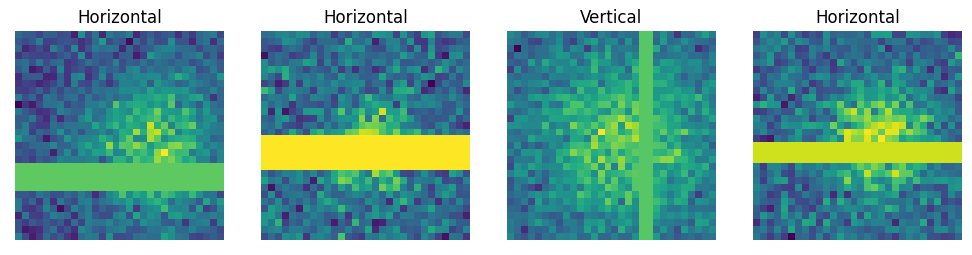

# Deep-Learning-Projects
Overview of some recent deep learning projects, all implemented in **PyTorch**.

# Description of the Projects

## Projects on Feed Forward Networks

- **Project: Adding Machine**
  + In this project, we build a feedforward neural network (FFN) capable of adding two integers between -10 and 10. To ensure the consistency of our results, we conduct an experiment by constructing the same model architecture ten times and evaluating the obtained results. The file that contains the code is  ``adding_machine.ipynb``.

      
- **Project: Wine Dataset**
    +  In **Part 1** of this project, we utilize the wine-quality dataset to build a simple deep learning model for classifying wine quality based on physicochemical tests. Furthermore, we conduct a parametric experiment, testing various batch sizes and comparing their accuracy. Finally, we evaluate the outcomes derived from the experiment. The file that contains the code is ``experiment_minibatch_size.ipynb``.
       
    +  In **Part 2** of this project, we aim to predict missing values for the 'residual sugar' column in the wine dataset. Since the original wine dataset does not contain any missing values in the 'residual sugar' column, we need to artificially introduce them. To create these missing values, we randomly select 10 rows where we set the 'residual sugar' to NaN. Subsequently, we build a regression model to predict these missing values. Finally, we evaluate the results obtained from the model. The name of the code file is ``predict_missing_residual_sugar.ipynb``.
      
    +  **Part 3** of this project involves comparing two weight initialization methods, Kaiming and Xavier, using the wine dataset. After the experiment, we evaluate the results with T-tests. The name of the code file is ``Kaming_Xavier_weight_initialization.ipynb``.
 

- **Project: MNIST Dataset**
   + The objective of **Part 1** in this project is to evaluate the performance of a deep learning model on unseen data. For this purpose, we will train a model using the MNIST database, comprising images of handwritten digits from 0 to 9. To assess the impact of unseen data, we intend to exclude the digit 7 from the training set. Subsequently, we will evaluate the model's predictions on images containing the digit 7. The file that contains the code is ``mystery of the missing 7.ipynb``.
 
## Projects on Autoencoders

- **Project: Autoencoder - How many units?**
  +  In this project, our goal is to create a deep learning model with an autoencoder architecture. Additionally, we conduct a parametric experiment to answer the question: What is the optimal combination of encoding/decoding units and latent units within a specified range, aiming for minimal loss? After conducting the experiment, we visualize and evaluate the obtained results. The file that contains the code is ``how_many_units.ipynb``.

## Projects on Convolutional Neural Networks
- **Project: Autoencoder on Occcluded Gaussians**
  +  In this project, we build an CNN based autoencoder capable of removing occlusions on Gaussians. To achieve our goal, we create two datasets consisting of images of a two-dimensional Gaussian distribution. The images in both datasets are almost the same but differ in one single aspect. In one dataset, we artificially introduce occlusions consisting of random bars, whereas in the other dataset, the images remain in their original state without introducing occlusions. Next, we construct a CNN autoencoder with an architecture designed to remove occlusions on Gaussians. Finally, we evaluate and visualize the results obtained from our model. The file that contains the code is ``AEs_on_occluded_Gaussians.ipynb``.
- **Project: CIFAR-Autoencoder**
  + In this project, we construct a Convolutional Neural Network (CNN)-based autoencoder to encode images from the CIFAR-10 dataset. The name of the code file is `CIFAR_Autoencoder.ipynb`.
- **Project: Classification on the Fashion-MNIST Dataset**
  + In this project, we construct a Convolutional Neural Network (CNN) to classify the Fashion-MNIST dataset into its ten different fashion categories. After constructing the CNN, we evaluate and plot the obtained results. The name of the code file is `classification_FashionMNIST.ipynb`.
- **Project: Psychometric Functions in CNNs**
  + In this project, we are building a CNN that is able to simulate a psychometric function. A psychometric function maps the decision probability in binary classification studies when the stimuli are continuous. Specifically, we aim to simulate a psychometric function capable of deciding whether a given image contains a vertical or horizontal line.
  + To achieve this goal, we build a CNN model and train it on 1x30x30 images of Gaussian noise plus random vertical or horizontal lines (see the picture below). We then evaluate and plot our results.
  

  
  + In a further step, we explore our previously trained model by subjecting it to new images. These images, of shape 1x30x30, differ from the training images because they have not only horizontal and vertical lines but also lines with a slope ranging from -30 to 30 (see the picture below). Next, we evaluate what is the predicted outcome on those images and plot again our results. The name of the code file is `psychometric_functions_in_CNNs.ipynb`.
  

## Projects on Transfer Learning
- **Project: Transfer Learning - Letters to Numbers**
  + In this project, we aim to apply the concept of transfer learning using a CNN classification model designed for classifying images from the EMNIST dataset (achieving an accuracy above 90%). We reuse this model to classify images from the MNIST dataset, breaking down the approach into four steps:
    - __Step 1__: We first assess the performance of the source model on the FMNIST dataset.
    - __Step 2__: Next, we apply the unchanged source model to the MNIST dataset and evaluate the results.
    - __Step 3__: Then, we modify the output layer of our source model from 26 to 10 units, where 26 represents the number of different labels in the EMNIST dataset, and 10 is the number of labels in the MNIST dataset. We evaluate the performance of this modified source model.
    - __Step 4__: In the final step, we create an untrained new model instance of the modified source model, referred to as the target model. We assign the weights of the trained but unchanged source model to the target model. Moreover, we subject it to a special kind of training, where we freeze the weights of all layers except the output layer. Subsequently, we assess the performance of the target model.
  + The name of the code file is `letters_to_numbers.ipynb`.
- **Project - Transfer learning with VGG-16 net**
  + In this project, our goal is to perform transfer learning using the VGG-16 net. Specifically, we leverage the VGG-16 net, initially trained on images belonging to 1000 classes, for predictions on the STL-10 dataset, which consists of images with only 10 different classes. To achieve this, we need to change the output layer from originally 1000 units to 10 units. After these adaptations, we evaluate our results by plotting them. The file that contains the code is ``VGG-16.ipynb``.

  
